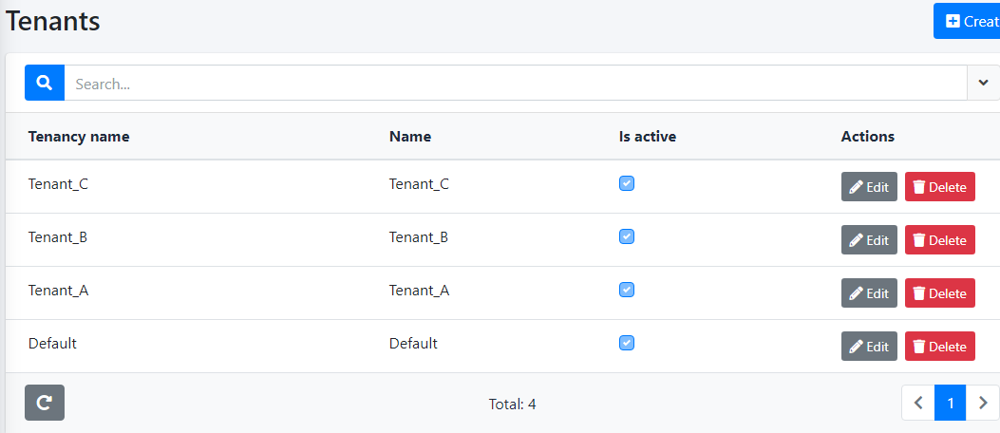
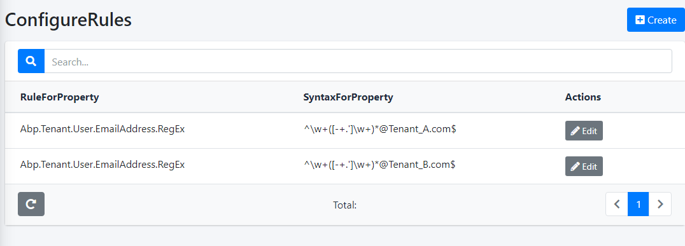

# Important
[Script DB Localization & Validation Rule](https://github.com/ravindracs0071/abp_boiler_poc/blob/main/sql-script/Localization_N_ConfigureRuleScript.sql)

Scenario 1
[Enable tenant wise DB Localization](https://github.com/ravindracs0071/abp_boiler_poc/blob/main/aspnet-core/src/DemoCompany.DemoProject.Web.Core/DemoProjectWebCoreModule.cs)
```
            // Use database for language management
            Configuration.Modules.Zero().LanguageManagement.EnableDbLocalization();
```

Scenario 2
Using Fluent Validator: Customize API Validate Model Validation 
E.g. - In current POC, we are validating email address based on tenant based configuration 
[Fluent Validation on Create User Dto](https://github.com/ravindracs0071/abp_boiler_poc/blob/main/aspnet-core/src/DemoCompany.DemoProject.Application/Users/Dto/CreateUserDto.cs)
```   
   #region Tenant Wise Configure Rule Validation

    public class CreateUserDtoFluentValidator : AbstractValidator<CreateUserDto>
    {
        public CreateUserDtoFluentValidator()
        {
            var configureRuleService = IocManager.Instance.Resolve<ConfigureRule.IConfigureRuleAppService>();
            //Same property to be configured in DB with Expression Table name : ConfigureRule
            var EmailAddressValidationRule = configureRuleService.GetEntityByRuleForProperty(CreateUserDtoConsts.RuleForProperty)?.SyntaxForProperty;

            if (!string.IsNullOrEmpty(EmailAddressValidationRule)) 
                RuleFor(x => x.EmailAddress).Matches(EmailAddressValidationRule);
        }
    }

    #endregion

    public class CreateUserDtoConsts
    {
        /// <summary>
        /// Same property to be configured in DB with Expression Table name : ConfigureRule
        /// </summary>
        public const string RuleForProperty = "Abp.Tenant.User.EmailAddress.RegEx";
    }
```

# Screenshots

####


#### 


# Documentation

* [ASP.NET Core MVC & jQuery version.](https://aspnetboilerplate.com/Pages/Documents/Zero/Startup-Template-Core)
* [ASP.NET Core & Angular  version.](https://aspnetboilerplate.com/Pages/Documents/Zero/Startup-Template-Angular)

# License

[MIT](LICENSE).
